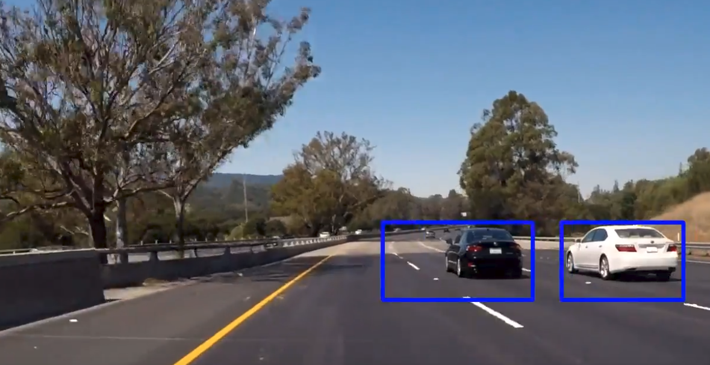
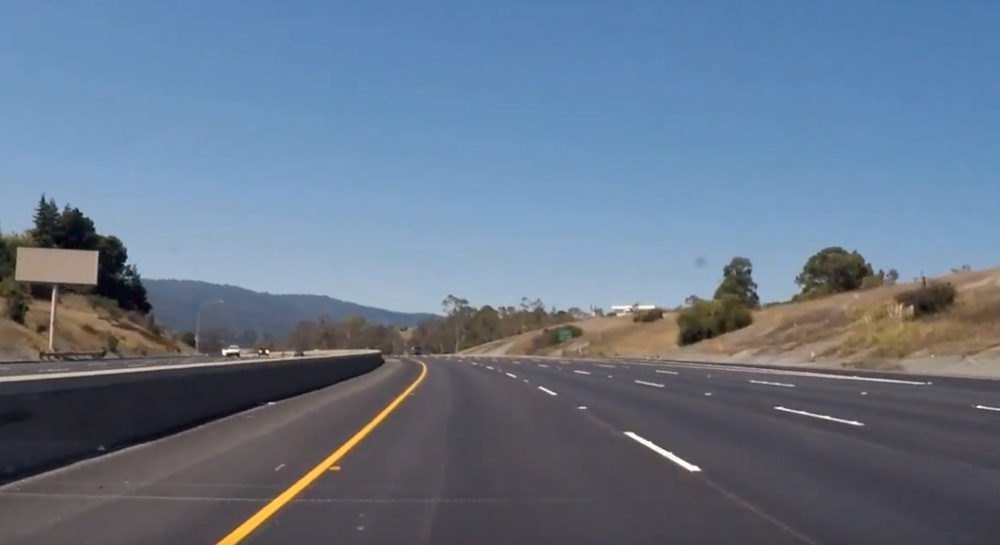

# Vehicle Detection Project

The goals / steps of this project are the following:

* Perform a Histogram of Oriented Gradients (HOG) feature extraction on a labeled training set of images and train a classifier Linear SVM classifier
* Implement a sliding-window technique and use your trained classifier to search for vehicles in images.
* Run your pipeline on a video stream (start with the test_video.mp4 and later implement on full project_video.mp4) and create a heat map of recurring detections frame by frame to reject outliers and follow detected vehicles.
* Estimate a bounding box for vehicles detected.

---

The code for this project is contained in [the Jupyter notebook file p5.ipynb](p5.ipynb)

---


*"Sections"* mentioned here are references to the jupyter notebook file [p5.ipynb](p5.ipynb).


#### 1. HOG features from the training images.

In *Section 3*, I started by reading in all the `vehicle` and `non-vehicle` images.  Here is an example of one of each of the `vehicle` and `non-vehicle` classes:


I then tried extracting features by color/spatial elements only. This is shown in *Section 5*. I trained an SVM classifier based on these features. This is shown in *Section 6*. As you can tell, the accuracy was around 90%, not very good. Hence I applied HOG features to my training algorithm. 

I explored different color spaces and different `skimage.hog()` parameters (`orientations`, `pixels_per_cell`, and `cells_per_block`).  I grabbed random images from each of the two classes and displayed them to get a feel for what the `skimage.hog()` output looks like.

I created a method using a Histogram of Gradients called get_hog_features() in *Section 7* of the project code. This is similar to the method provided in the lesson. We apply the input car and non-car images to get HOG images, for example:


( Parameters are orientation = 11,  pixels_per_cell=(16, 16), cells_per_block = (2,2) )

#### 2. Explain how you settled on your final choice of HOG parameters.

I tried various combinations of parameters starting from orientation of 9 and pixels per cell of 8 in the class examples. For example:

*Test Cfg 1*
```
colorspace = 'YUV'
orientation = 10
pix_per_cell = 15
cell_per_block = 2
hog_channel = 'ALL'
51.01 Seconds to extract HOG features...
9.13 Seconds to train SVC...
Test Accuracy of SVC =  0.9471
0.00255 Seconds to predict 10 labels with SVC
```

*Test Cfg 2*
```
colorspace = 'YUV'
orientation = 11
pix_per_cell = 14
cell_per_block = 2
hog_channel = 'ALL' 
49.09 Seconds to extract HOG features...
12.12 Seconds to train SVC...
Test Accuracy of SVC =  0.9403
0.00241 Seconds to predict 10 labels with SVC
``` 

*Test Cfg 3*
```
colorspace = 'RGB'
orientation = 11
pix_per_cell = 15
cell_per_block = 2
hog_channel = 'ALL'
53.39 Seconds to extract HOG features...
11.52 Seconds to train SVC...
Test Accuracy of SVC =  0.94
0.00427 Seconds to predict 10 labels with SVC
```

*Test Cfg 4*
```
colorspace = 'RGB'
orientation = 10
pix_per_cell = 14
cell_per_block = 2
hog_channel = 'ALL'
51.6 Seconds to extract HOG features...
10.9 Seconds to train SVC...
Test Accuracy of SVC =  0.9375
0.00247 Seconds to predict 10 labels with SVC
```

*Test Cfg 5*
```
colorspace = 'YUV'
orientation = 11
pix_per_cell = 16
cell_per_block = 2
hog_channel = 'ALL'
62.04 Seconds to extract HOG features...
12.48 Seconds to train SVC...
Test Accuracy of SVC =  0.9775
0.00243 Seconds to predict 10 labels with SVC
```

After 15+ tries, I ended up with best values of:
```
colorspace = 'YUV' 
orientation = 11
pixels per cell = 16
cells per block = 2
hog channels = 'ALL'
spatial size = 32
histogram bins = 32
```

I choose to bias accuracy over speed as I later applied an averaging and cropping algorithm to reduce the processing required (e.g. the sky and opposite lane). Also, the YUV colorspace proved best compared to YCrCb, RGB, HSV and HSL which created too many false positives in their application. The reasoning to go YUV was also based on the previous project *Advanced Lane Finding*. In that project image quality was the main source of false positives, and the tracking of the white lines (similar to white car in this project) where processing images in the YUV colorspace proved effective. 

#### 3. Describe how (and identify where in your code) you trained a classifier using your selected HOG features (and color features if you used them).

The classifier of choice I used was a Linear Support Vector Machine. This is listed in section labeled **Goal 1** of the [p5.ipynb](p5.ipynb) file. I attempted to use color features into the SVM. In order to train the classifier:

1. I extract the hog features in YUV space of the cars and non-car images.
2. Create an array stack of feature vectors 
3. Define the labels vector or cars and non-cars
4. Randomized training and test sets (15% and 85% respectively)
5. Apply a scaler
6. Train the SVM classifier with the training data
7. Verify the model by using the test data (aka the predict() method) and develop a testing accuracy value.

With the above settings in *Section 2*, I was averaging about 97% accuracy with my configuration.

### Sliding Window Search

#### 1. Describe how (and identify where in your code) you implemented a sliding window search.  How did you decide what scales to search and how much to overlap windows?

In the section labeled **Goal 2**, I used the find_cars() method explained in the lesson materials. I convert the image to YUV, scale & normalize the image, and extracted hog features for the entire image. Using the full image hog features, I used the sub-window (from the sliding window technique) containing those features, then extracted the color features of that sub-sampled image. The resulting feature vector is fed that into the SVM classifier. If the classifier found a match, i.e. a car, its bounding box is recorded. The list of bounding boxes are then processed for false positives. 


##### Multi-Scale Search

For the pipeline, we need to have search windows of varying sizes to handle the multi-scale effect of cars driving away and/or entering view of our car. 

I ended up with the following algorithm of scales, hence I would call find_cars() multiple times and aggregate the identified bounding boxes into one list:

| y-start   | y-end   | scale   |
| ---	|---	|---	|
| 400   | 475   |  1.0  |
| 420   | 490   |  1.0  |
| 400   | 525   |  1.5  |
| 450   | 600   |  1.5  |
| 400   | 600   |  2.0  |
| 405   | 600   |  2.0  |
| 400   | 545   |  1.5  |
| 450   | 500   |  1.0  |


To remove false positives, such as the cars moving in the opposite lane/direction, I applied the following:

1. Crop the image to exclude the sky and on-coming lane.
2. apply a heat map that is based on multiple, valid detections of a car.
3. only allow areas of heat that are greater than 60x60 pixels

For example, the heat map on test image #1 using my classifier produces the following. I applied the scipy.ndimage.measurements.label() function to create a area that defines the heatmap as contiguous areas.


In the section labeled *Goal 3&4*, I apply the heatmap to the image having the following result:


#### 2. Show some examples of test images to demonstrate how your pipeline is working.  What did you do to optimize the performance of your classifier?

I used example images from the test directory and applied them to the pipeline. The result:


*Discussion: Optimization*

When I wrote the original classifier, using the lesson materials implemented RGB and YCbCr based features, I found that I was getting too many false positives or the reverse--no cars found. By optimizing the method to use the YUV space, previously shown great results in *Advanced Lane Finding*, I was able to detect cars with less false positives. Adding multiple passes by changing the window sizes and scale/overlap allowed more chances for a car to be detected as well. Using the heatmap then rejected further false positives. 

The pipeline is described in *Section 8*.

### Video Implementation

#### 1. Provide a link to your final video output.  Your pipeline should perform reasonably well on the entire project video (somewhat wobbly or unstable bounding boxes are ok as long as you are identifying the vehicles most of the time with minimal false positives.)

* Here's the pipeline output of the short video component:
GitHub version: [video_output.mp4](./video_output.mp4)
[](https://youtu.be/kIQxw0tCPHQ "Click to Play Video")

* Here's the pipeline output of the project video component:
GitHub version: [video_output_long.mp4](./video_output_long.mp4)
[](https://youtu.be/WdoH5_FG734 "Click to Play Video")

The application of the videos are expressed in the section labeled *Goal 3*.

#### 2. Describe how (and identify where in your code) you implemented some kind of filter for false positives and some method for combining overlapping bounding boxes.

In order to reduce false positives:
* I cropped the image search area to only report boxes from the car's view and the lanes to the right (since the car was in the left lane). 
* I also only took cars that had heatmaps of a certain size (5000px or a rectangle of 50x100). 
* Lastly, for the streaming video, I also used the previous image's heatmap to enhance the detection of a car since it is unlikely for a car to "jump" in location. 

These filter techniques are expressed in the section label *Section 8* of the [p5.ipynb](p5.ipynb) file.

---

### Discussion

#### 1. Briefly discuss any problems / issues you faced in your implementation of this project.  Where will your pipeline likely fail?  What could you do to make it more robust?

* Again, like the *Advanced Lane Finding* project, image quality (lighting, contrast, viewing angle) was a major problem for this technique. Lighting contributed to sensitive search results: slight adjustments to the sliding window technique either resulted in a large number of false positives or not vehicle detected at all. Also texture transitions (concrete to asphalt) proved difficult for this classifier. 

* It appeared the white cars were hard to detect, such that techniques used in the *Advanced Lane Finding* and *Behavioral Cloning* projects could be used here. As for comparison to a CNN approach, the CNN will better identify cars and can leverage better computation resources (it's faster). The SVM technique can be used as an additional tool to identify false positives.

* Speed vs accuracy during classification is important, and I choose to bias accuracy over speed. If I choose speed I would have likely gotten more false positives as the classifier would output more 'jittery' results. Regardless, the sliding window approach is somewhat inefficient as it requires multiple searches to get a consensus on one vehicle, hence why I had to implement multiple calls to find_cars().

* Lastly, with my filtering and averaging techniques, this fairly worked well on this type of road: a straight lane. My car switching lanes or large curves in the lane would likely cause my pipeline to fail.

