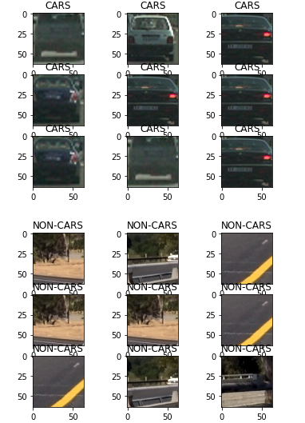
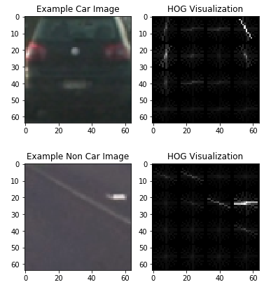
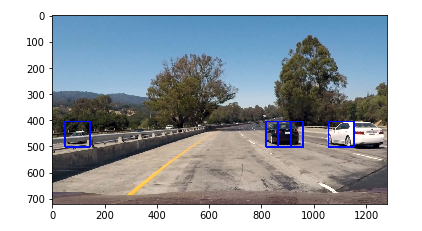
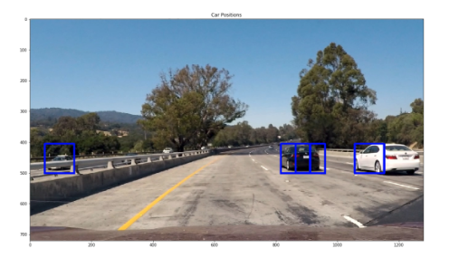
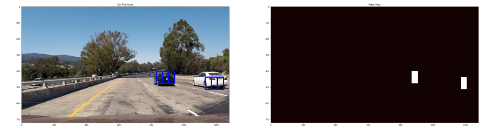
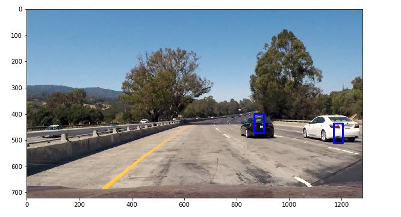
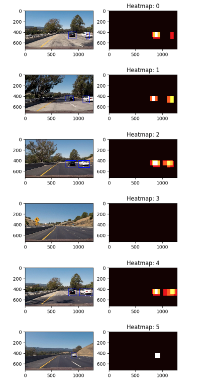

**Vehicle Detection Project**

The goals / steps of this project are the following:

* Perform a Histogram of Oriented Gradients (HOG) feature extraction on a labeled training set of images and train a classifier Linear SVM classifier
* Implement a sliding-window technique and use your trained classifier to search for vehicles in images.
* Run your pipeline on a video stream (start with the test_video.mp4 and later implement on full project_video.mp4) and create a heat map of recurring detections frame by frame to reject outliers and follow detected vehicles.
* Estimate a bounding box for vehicles detected.

The code for this project is contained in the Jupyter notebook P5.ipynb

#### 1. Explain how (and identify where in your code) you extracted HOG features from the training images.

I started by reading in all the `vehicle` and `non-vehicle` images.  Here is an example of one of each of the `vehicle` and `non-vehicle` classes:

I then explored different color spaces and different `skimage.hog()` parameters (`orientations`, `pixels_per_cell`, and `cells_per_block`).  I grabbed random images from each of the two classes and displayed them to get a feel for what the `skimage.hog()` output looks like.

I created a method using a Histogram of Gradients called get_hog_features(). We apply the input car and non-car images to get a HOG image:

#### 2. Explain how you settled on your final choice of HOG parameters.

I tried various combinations of parameters starting from orientation of 9 and pixels per cell of 8 in the class examples. For example:

colorspace = 'YUV'

orient = 10

pix_per_cell = 15

cell_per_block = 2

hog_channel = 'ALL'

51.01 Seconds to extract HOG features...

9.13 Seconds to train SVC...

Test Accuracy of SVC =  0.9471

0.00255 Seconds to predict 10 labels with SVC

=============================================================
colorspace = 'YUV'

orient = 11

pix_per_cell = 14

cell_per_block = 2

hog_channel = 'ALL' 

49.09 Seconds to extract HOG features...

12.12 Seconds to train SVC...

Test Accuracy of SVC =  0.9403

0.00241 Seconds to predict 10 labels with SVC

=============================================================
colorspace = 'RGB'

orient = 11

pix_per_cell = 15

cell_per_block = 2

hog_channel = 'ALL'

53.39 Seconds to extract HOG features...

11.52 Seconds to train SVC...

Test Accuracy of SVC =  0.94

0.00427 Seconds to predict 10 labels with SVC

=============================================================
colorspace = 'RGB'

orient = 10

pix_per_cell = 14

cell_per_block = 2

hog_channel = 'ALL'

51.6 Seconds to extract HOG features...

10.9 Seconds to train SVC...

Test Accuracy of SVC =  0.9375

0.00247 Seconds to predict 10 labels with SVC

=============================================================
colorspace = 'YUV'

orient = 11

pix_per_cell = 16

cell_per_block = 2

hog_channel = 'ALL'

62.04 Seconds to extract HOG features...

12.48 Seconds to train SVC...

Test Accuracy of SVC =  0.9775

0.00243 Seconds to predict 10 labels with SVC

=============================================================

I ended up with best values of:

* colorspace = 'YUV' 
* orientiation = 11
* pixels per cell = 16
* cells per block = 2
* hog channels = 'ALL'
* spatial size = 32
* histogram bins = 32

I went with best accuracy over speed as I later applied an averaging and culling algorithm to make each image to process smaller and ignored regions of the images that do not need processing (e.g. the sky). Also YUV colorspace proved best use as RGB and HSL (from previous projects proved good choices) created too mnay false positives.

#### 3. Describe how (and identify where in your code) you trained a classifier using your selected HOG features (and color features if you used them).

The classifier of choice I used was a Linear Support Vector Machine. This is listed in Section 25 of the P5.ipynb file. I attempted to use color features into the SVM. In order to train the classifier:

1. I extract the hog features i YUV space of the cars and non-car images.
2. Create an array stack of feature vectors 
3. Define the labels vector or cars and non-cars
4. Randomized training and test sets (15% and 85% respectively)
5. Apply a scaler
6. Train the SVM classifier with the training data
7. Verify the model by using the test data and the predict() method.

With the above settings in Section 2, I was averaging about 97% accuracy.

### Sliding Window Search

#### 1. Describe how (and identify where in your code) you implemented a sliding window search.  How did you decide what scales to search and how much to overlap windows?

I used the find_cars() method explained in the lesson materials. I convert he image to YUV, scale & normalize the image if provided, used hog features for the entire image. using the full image hog features, I extracted the image sub-window, then applied the color and hostogram features to the sub sampled image. Then fed that into the SVM classifier. If the classifer found a match, i.e. a car, the bounding bobx is recorded and we store that in a list. The list is then processed for false positives. 

For the pipeline, we need to have search windows of varying sizes to handle the multiscale effect of cars driving away or entering view of our car. 

I ended up with the following algorithm that adds find cars of various sliding window sizes:

| y-start   | y-end   | scale   |
| ---	|---	|---	|
| 400   | 475   |  1.0  |
| 420   | 490   |  1.0  |
| 400   | 525   |  1.5  |
| 450   | 600   |  1.5  |
| 400   | 600   |  2.0  |
| 405   | 600   |  2.0  |
| 400   | 545   |  1.5  |
| 450   | 500   |  1.0  |

To remove false positives, such as the cars moving in the opposite lane/direction, I applied the following:

1. Crop the image to exclude the sky and on-coming lane.
2. apply a heat map that is based on multiple, valid detections of a car.
3. only allow areas of heat that are greater than 60x60 pixels

For example, the heat map on test image #1 using my classifier produces the following. I applied the scipy.ndimage.measurements.label() function to create a area that defines the heatmap as contiguous areas.

Apply the heatmap to the image creates the following:

#### 2. Show some examples of test images to demonstrate how your pipeline is working.  What did you do to optimize the performance of your classifier?

Ultimately I searched on two scales using YUV, 3-channel HOG features plus spatially binned color and histograms of color in the feature vector, which provided a nice result.  Here are some example images from the pipeline:

When I wrote the original classifier, using the lesson materials and that implmented RGB and YCbCr based features, I found that I was getting to many false positives or the reverse--no cars found. By optimizing the method to use the YUV space, which has shown great results in finding lane lines and signs (previous projects) I was able to detect cars with less false positives. Adding multiple passes by changing the window sizes and sclae/overlap allowed more chances for a car to be detected as well. Using the heatmap then rejected further false positives.

### Video Implementation

#### 1. Provide a link to your final video output.  Your pipeline should perform reasonably well on the entire project video (somewhat wobbly or unstable bounding boxes are ok as long as you are identifying the vehicles most of the time with minimal false positives.)

Here's the pipeline output of the short video component [link to my video result](./video_output.mp4)
Here's the pipeline output of the project video component [link to my video result](./video_output_long.mp4)

#### 2. Describe how (and identify where in your code) you implemented some kind of filter for false positives and some method for combining overlapping bounding boxes.

In order to reduce false positives, I cropped the image to only report boxes from the car's view. I also only took cars that had heatmmaps of a certain size (>60x60). Lastly, for the streaming video, I also used the previous image's heatmap to enhance the detection of a car since it is unlikely for a car to "jump" in location. This is expressed in section 81, starting at line 42 and line 71.                           

---

### Discussion

#### 1. Briefly discuss any problems / issues you faced in your implementation of this project.  Where will your pipeline likely fail?  What could you do to make it more robust?

